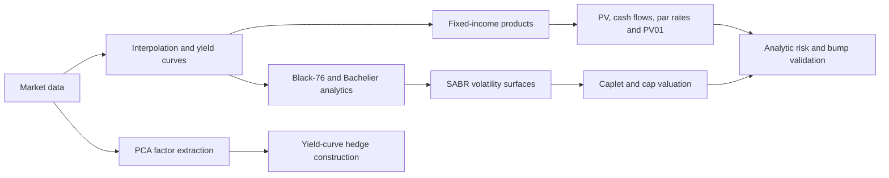

# Quantitative Finance Projects

A portfolio of Python projects in fixed-income pricing, yield-curve risk, PCA hedging, European option analytics, and SABR volatility modeling.

The repositories extend a course-provided quantitative-finance framework with numerical methods, product models, valuation engines, market-risk analytics, and notebook-based validation. Each linked project identifies my implementation work separately from the shared course infrastructure.

## Highlights

- Extended a course-provided modular fixed-income analytics library with SOFR/Fed Funds basis swaps and RFR caplet/cap products; calculated PV, cash flows, par spreads, PV01, and first-order curve and SABR sensitivities, validating analytic risk against bump-and-revalue results.
- Implemented Black-76, Bachelier, and SABR volatility analytics plus NumPy-based PCA hedging across 1Y–30Y swap rates; extracted three principal factors explaining over 99% of sample variation and constructed factor-neutral hedge notionals using least squares.

## Quantitative Workflow

## Featured Work

### [SOFR Caplet/Cap Pricing and SABR Risk Analytics](https://github.com/yuqingyan2003/FRE-GT-9743-Assignment-9)

- Built RFR caplet and cap products, factories, serialization, and valuation-engine integration.
- Interpolated two-dimensional SABR parameter surfaces across expiry and tenor.
- Propagated discount-factor, forward-rate, and volatility-parameter sensitivities into first-order risk reports.
- Checked analytic sensitivities against bump-and-revalue calculations.

### [Overnight-Index Basis Swap Valuation](https://github.com/yuqingyan2003/FRE-GT-9743-Assignment-6)

- Modeled SOFR-versus-Federal-Funds compounded overnight legs.
- Calculated PV, cash flows, par spread, PV01, and state-variable sensitivities.
- Aggregated weighted portfolio cash-flow reports with aligned schemas and distinct leg identifiers.

### [PCA Yield-Curve Risk Hedging](https://github.com/yuqingyan2003/FRE-GT-9743-Assignment-5)

- Implemented PCA from first principles with NumPy covariance and eigendecomposition routines.
- Reduced correlated 1Y–30Y swap-rate movements to three factors explaining more than 99% of sample variation.
- Solved hedge notionals with least squares and evaluated residual exposure in key-rate and factor space.

### [European Options and SABR Volatility](https://github.com/yuqingyan2003/FRE-GT-9743-Assignment-7) · [SABR Density and Simulation](https://github.com/yuqingyan2003/FRE-GT-9743-Assignment-8)

- Implemented Black-76 and Bachelier prices, Greeks, implied-volatility inversion, and quote conversion.
- Added SABR parameter sensitivities, risk-neutral density diagnostics, Euler–Maruyama simulation, and empirical quantile mapping.

## Complete Project Map

| Project | Quantitative focus | Selected techniques |
|---|---|---|
| [Assignment 1](https://github.com/yuqingyan2003/FRE-GT-9743-Assignment-1) | Numerical curve primitives | Piecewise-constant interpolation, exact integration, analytic ordinate gradients |
| [Assignment 2](https://github.com/yuqingyan2003/FRE-GT-9743-Assignment-2) | RFR product construction | Schedule generation, fixed/overnight cash-flow streams, swap composition, registries |
| [Assignment 4](https://github.com/yuqingyan2003/FRE-GT-9743-Assignment-4) | Product reporting | Visitor pattern, single dispatch, recursive portfolio display |
| [Assignment 5](https://github.com/yuqingyan2003/FRE-GT-9743-Assignment-5) | Yield-curve hedging | PCA, factor loadings, explained variance, least-squares hedge optimization |
| [Assignment 6](https://github.com/yuqingyan2003/FRE-GT-9743-Assignment-6) | Basis-swap valuation | SOFR/Fed Funds legs, PV, par spread, PV01, cash-flow and risk aggregation |
| [Assignment 7](https://github.com/yuqingyan2003/FRE-GT-9743-Assignment-7) | European option analytics | Black-76, Bachelier, Greeks, implied volatility, numerical root finding |
| [Assignment 8](https://github.com/yuqingyan2003/FRE-GT-9743-Assignment-8) | SABR distribution analytics | Volatility conversion, sensitivities, density extraction, simulation, quantile mapping |
| [Assignment 9](https://github.com/yuqingyan2003/FRE-GT-9743-Assignment-9) | RFR option pricing and risk | Caplets/caps, 2D SABR surfaces, valuation engines, analytic risk propagation |

This portfolio includes the eight standalone repositories maintained for the course; Assignment 3 is not represented as a separate repository.

## Technical Stack

- **Languages and numerical computing:** Python, NumPy, pandas, SciPy
- **Quantitative libraries:** QuantLib, PySABR
- **Methods:** curve interpolation, cash-flow modeling, numerical integration, root finding, PCA, least squares, Monte Carlo simulation, finite differences, analytic sensitivities
- **Engineering:** object-oriented design, factories, registries, visitors, serialization, modular valuation engines, Jupyter validation workflows

## Validation Approach

The notebooks emphasize numerical verification rather than isolated formula implementation. Depending on the project, validation includes analytic-versus-bump sensitivity comparisons, implied-volatility price recovery, normal/lognormal price matching, covariance reconstruction, explained-variance checks, and residual hedge-risk analysis.

## Attribution

These projects were developed for NYU FRE-GY 9743 using a course-provided `FixedIncomeLib` architecture. Shared framework components remain credited to their original contributors. Each repository's **My Contributions** section describes the extensions and analytics I implemented.

For a project-by-project technical summary, see [PROJECTS.md](PROJECTS.md).
